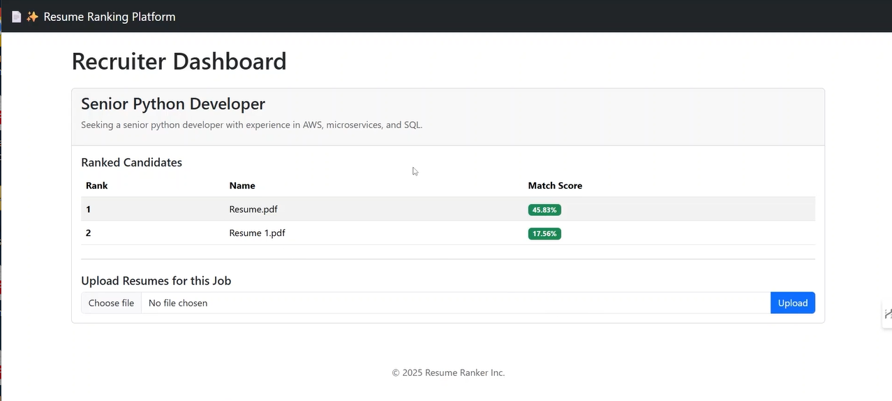

AI-Powered Resume Ranking Platform
A cloud-native, AI-powered platform designed to automate the initial screening of resumes. This project uses a decoupled, event-driven architecture on AWS, with all infrastructure managed by Terraform. A Python backend uses an NLP model to semantically compare each uploaded resume against the job description, providing a ranked list of the most qualified applicants.

Live Demo
Here is a short video demonstrating the full, end-to-end workflow of the application, from uploading a resume to seeing the final ranked result on the dashboard.

Key Features
Automated Resume Scoring: Uses a Sentence-Transformer model for semantic analysis, going beyond simple keyword matching.

Decoupled & Scalable Architecture: Leverages AWS SQS to create an event-driven system that can handle large volumes of uploads without affecting user experience.

Infrastructure as Code (IaC): The entire cloud environment is defined and managed with Terraform, ensuring a repeatable and automated setup.

Containerized Application: Both the frontend and backend are containerized with Docker for consistent and reliable execution in any environment.

Professional Frontend: A clean, modern, and responsive user interface built with Flask and Bootstrap.

System Architecture
The application follows a decoupled, event-driven architecture to ensure scalability and resilience.

➡️ INSTRUCTION: Insert your architecture diagram image here. Save it in the assets folder and use the syntax: 

Frontend (Flask App): The recruiter interacts with the web UI.

Upload: The Flask app uploads the resume file to S3 and sends a message to SQS.

Backend Worker: A separate containerized Python service polls the SQS queue.

Processing: Upon receiving a message, the worker downloads the resume from S3, performs NLP analysis, and saves the final score to the RDS Database.

Display: The Flask app reads the updated scores from the RDS database to display on the dashboard.

Technology Stack
Category

Technologies

Cloud & DevOps

AWS (S3, SQS, RDS, VPC), Terraform, Docker

Backend

Python, Sentence-Transformers (NLP), Boto3, Psycopg2

Frontend

Flask, Gunicorn, HTML, Bootstrap CSS

Database

PostgreSQL (on AWS RDS)

Local Setup and Usage
Follow these steps to run the project on your local machine.

1. Prerequisites
AWS Account & IAM User with Administrator Access

AWS CLI configured (aws configure)

Terraform installed

Docker Desktop installed and running

Python 3.9+ installed

2. Deploy the Cloud Infrastructure
First, deploy all the necessary AWS resources using Terraform.

# Navigate to the terraform directory
cd terraform

# Initialize Terraform
terraform init

# Apply the configuration (this will create all AWS resources)
terraform apply

After applying, copy the output values for the rds_endpoint, s3_bucket_name, and sqs_queue_url.

3. Configure the Application
Update the configuration variables in the following files with the outputs from the previous step:

backend-worker/main.py

webapp/db.py

webapp/app.py

4. Build and Run with Docker
Build the Docker images for both services.

# Build the backend worker image
docker build -t tanya/resume-worker ./backend-worker

# Build the web application image
docker build -t tanya/resume-webapp ./webapp

Now, run the containers in two separate terminals. Remember to replace the placeholders with your AWS credentials and the Terraform outputs.

Terminal 1: Start the Backend Worker

docker run --rm -e AWS_ACCESS_KEY_ID="YOUR_ACCESS_KEY" -e AWS_SECRET_ACCESS_KEY="YOUR_SECRET_KEY" -e AWS_DEFAULT_REGION="us-east-1" -e S3_BUCKET_NAME="..." -e SQS_QUEUE_URL="..." -e DB_HOST="..." -e DB_USER="rankeradmin" -e DB_PASSWORD="yoursecurepassword123" --name resume-worker-container tanya/resume-worker

Terminal 2: Start the Web App

docker run --rm -p 8080:8080 -e AWS_ACCESS_KEY_ID="YOUR_ACCESS_KEY" -e AWS_SECRET_ACCESS_KEY="YOUR_SECRET_KEY" -e AWS_DEFAULT_REGION="us-east-1" -e S3_BUCKET_NAME="..." -e SQS_QUEUE_URL="..." -e DB_HOST="..." -e DB_USER="rankeradmin" -e DB_PASSWORD="yoursecurepassword123" --name resume-webapp-container tanya/resume-webapp

5. Access the Application
The application is now running! Navigate to http://127.0.0.1:8080 in your web browser.
